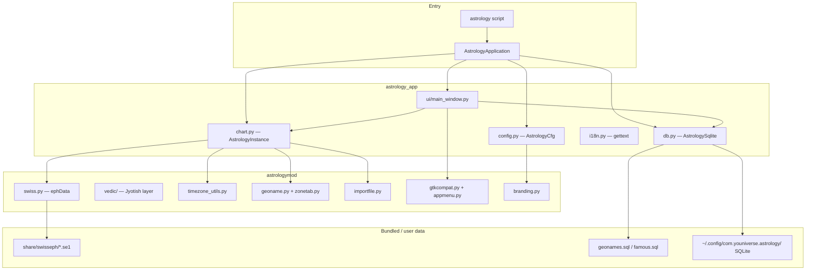
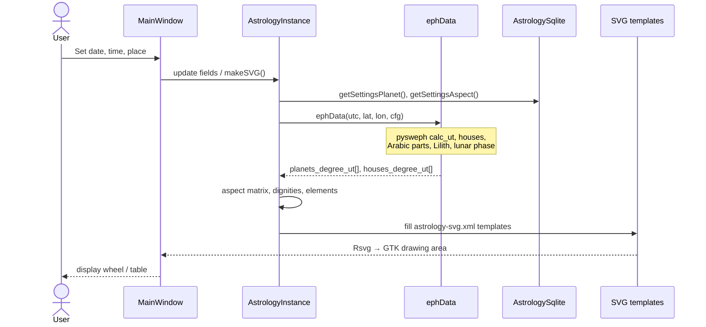
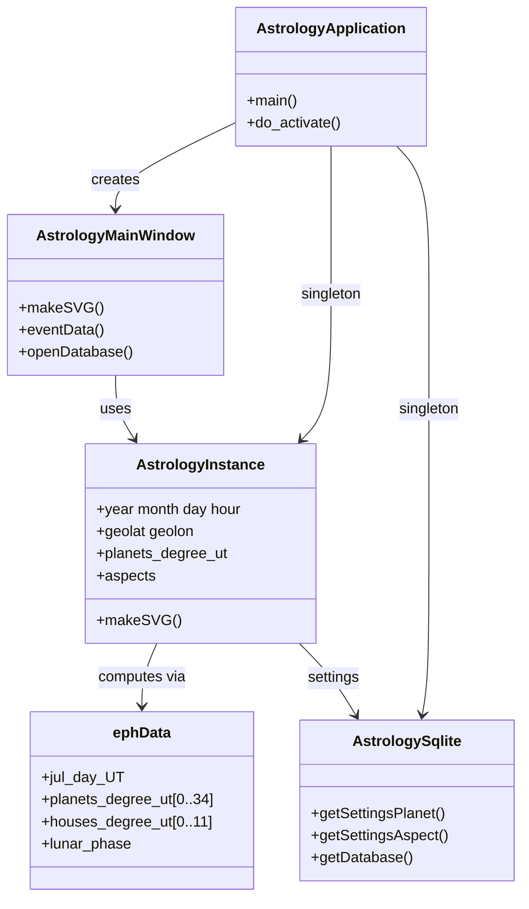
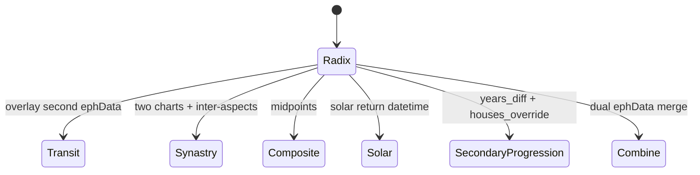
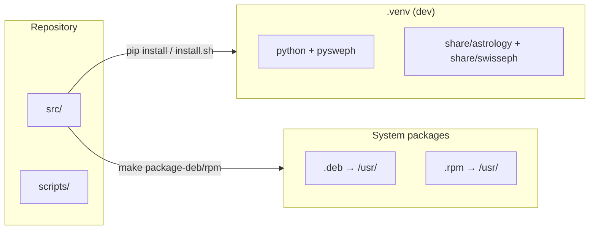
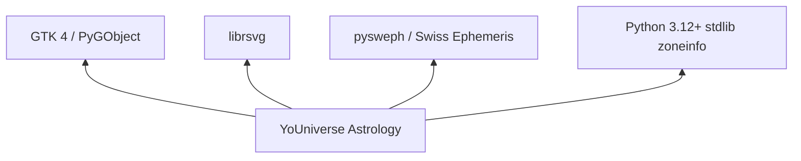

# Architecture

YoUniverse Astrology is a **GTK 4 desktop application** written in Python 3.12+. It computes charts with the **Swiss Ephemeris** (`pysweph`) and renders wheels as **SVG** inside a GTK window.

> Mermaid diagrams render on GitHub. For prose guides see [docs/architecture.rst](docs/architecture.rst) and the [Sphinx docs](docs/index.rst).

## Package overview

## Chart calculation flow

## Core types

## Chart modes

## Install layout

## Extension points

| Module | Purpose |
|--------|---------|
| `astrologymod.importfile` | Import Oroboros, Astrolog32, Skylendar, Zet8, XML |
| `astrologymod.dignities` | Essential dignity scores |
| `astrologymod.branding` | App id, homepage, config directory name |
| `astrologymod.vedic` | Nakshatra, 16 vargas, dashas, panchanga, yogas, muhurta, chart SVG |
| `astrology_app.db` | Planets, aspects, colors, labels (SQLite) |
| `locale/*/LC_MESSAGES/` | UI translations (gettext) |

## Dependencies

