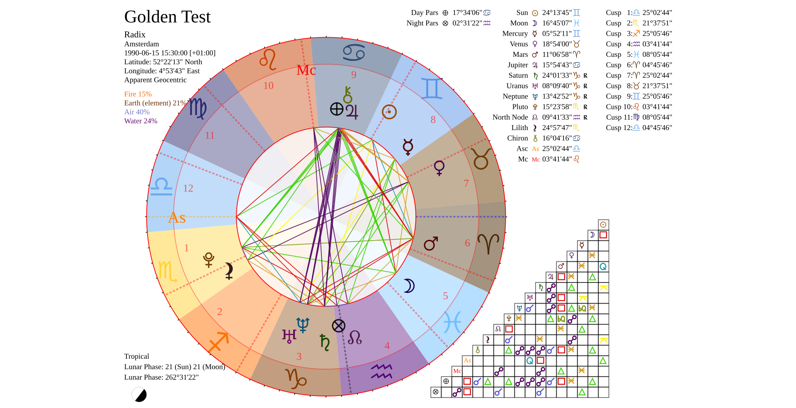
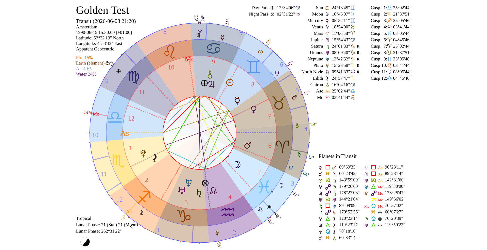
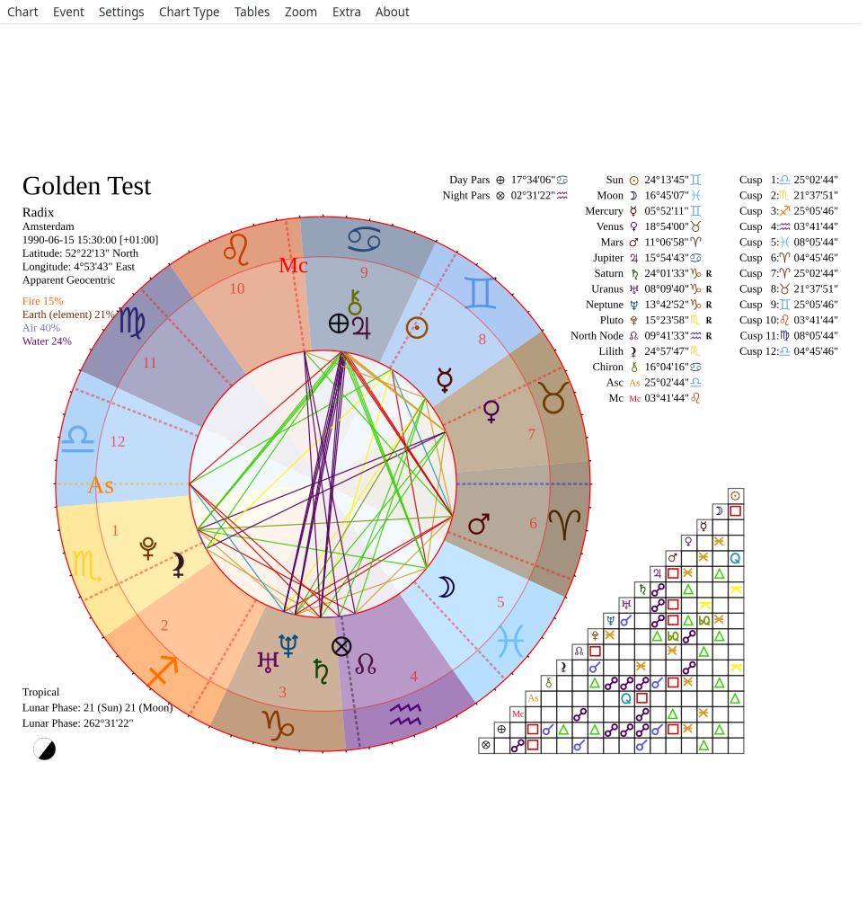
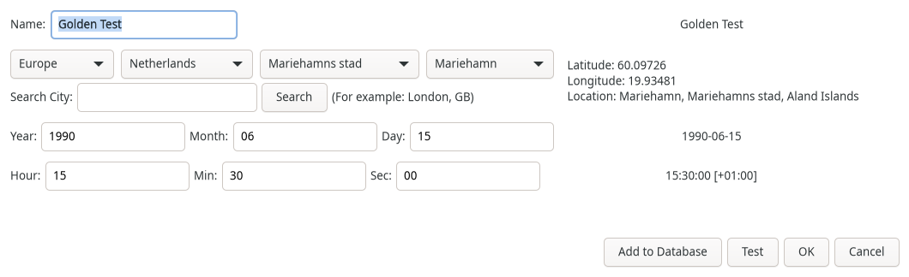
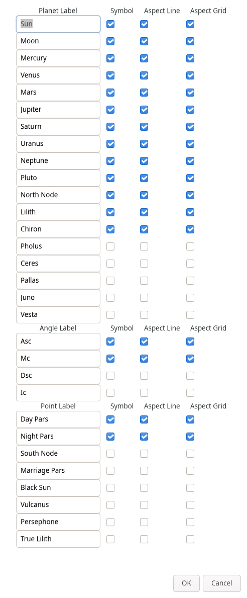

# YoUniverse Astrology

Desktop astrology application for **natal charts**, **transits**, **synastry**, **composites**, and **Swiss Ephemeris** calculations.

Built with Python 3.12+, GTK 4, PyGObject, and [pysweph](https://pypi.org/project/pysweph/).

[](https://github.com/YOUR_ORG/astrology/actions/workflows/tests.yml)
[](https://youniverse-astrology.readthedocs.io/en/latest/?badge=latest)
[](LICENSE)

## Features

- Natal, transit, synastry, composite, solar return, and secondary progression charts
- Customizable planets, aspects, colors, and house systems
- **Vedic (Jyotish)**: sidereal ayanamsa, whole-sign houses, North/South Indian main chart or wheel with drishti, 16 vargas, three dasha systems, panchanga, yogas, muhurta
- SVG chart wheel and table export (PNG, PDF, JPG)
- Offline geonames atlas and famous-people database
- Import/export for several legacy chart formats
- 20+ UI languages (gettext)

## Screenshots

| Natal chart | Transit view |
|-------------|--------------|
|  |  |

| Main window | Event editor | Planet settings |
|-------------|--------------|-----------------|
|  |  |  |

Regenerate with ``make update-screenshots`` (headless GTK + Xvfb; see `docs/screenshots/README.md`).

## Requirements

- **Python** 3.12+
- **GTK 4** and PyGObject

Debian/Ubuntu:

```bash
sudo apt install python3-dev python3-gi python3-gi-cairo \
  gir1.2-gtk-4.0 gir1.2-rsvg-2.0 librsvg2-bin imagemagick
```

Fedora:

```bash
sudo dnf install python3-devel python3-gobject gtk4 librsvg2-tools ImageMagick
```

## Install from source

```bash
git clone https://github.com/YOUR_ORG/astrology.git
cd astrology
./install.sh
source .venv/bin/activate
astrology
```

Swiss Ephemeris `.se1` files (JPL DE441) are downloaded during install. Skip with:

```bash
ASTROLOGY_SKIP_EPHE_UPDATE=1 ./install.sh
```

After code changes, refresh the installed launcher:

```bash
make run
# or: pip install --force-reinstall --no-deps ./src
```

**User data:** `~/.config/com.youniverse.astrology/` (see `astrologymod.branding.USER_CONFIG_DIR`)

## Distribution packages

```bash
make package-deb    # Debian/Ubuntu (.deb)
make package-rpm    # Fedora/RHEL (.rpm)
make package-macos  # macOS .app (run on macOS)
make package-windows # Windows zip (run in MSYS2 UCRT64)
make package        # Linux .deb + .rpm
```

Pre-built packages may be attached to [GitHub Releases](https://github.com/YOUR_ORG/astrology/releases).

## Documentation

| Document | Description |
|----------|-------------|
| [ARCHITECTURE.md](ARCHITECTURE.md) | **Mermaid** diagrams (components, sequence, class) |
| [docs/](docs/) | User and developer guides (Sphinx) |
| [PUBLISHING.md](PUBLISHING.md) | Pre-release checklist |
| [THIRD_PARTY_NOTICES.md](THIRD_PARTY_NOTICES.md) | Bundled data & library licenses |
| [CONTRIBUTING.md](CONTRIBUTING.md) | Development workflow |
| [CODE_OF_CONDUCT.md](CODE_OF_CONDUCT.md) | Community standards |
| [CHANGELOG.md](CHANGELOG.md) | Release history |
| [SECURITY.md](SECURITY.md) | Vulnerability reporting |
| [Support](.github/SUPPORT.md) | Where to get help |
| [Discussions](https://github.com/YOUR_ORG/astrology/discussions) | Community Q&A (enable in repo settings) |

Hosted docs: [Read the Docs](https://youniverse-astrology.readthedocs.io/) (import project after publish — see `docs/hosting.rst`).

Build HTML docs locally:

```bash
make docs
```

API reference is generated from Python docstrings under `src/`.

## Development

```bash
make dev-check   # lint + unit tests
make test-ci     # full CI suite
make docs        # Sphinx HTML
```

See [CONTRIBUTING.md](CONTRIBUTING.md) for details.

## Repository layout

```
Astrology/
├── src/          Installable Python package (src layout)
│   ├── astrologymod/       Core: ephemeris, Vedic, import, geonames
│   ├── astrology_app/      GTK 4 desktop UI and chart instance
│   ├── astrology_api/      Optional FastAPI HTTP backend
│   ├── data/               Bundled SQL and Vedic reference data
│   ├── icons/              App and aspect SVG assets
│   ├── locale/             gettext translations
│   ├── swisseph/           JPL DE441 ephemeris files (.se1)
│   └── debian/             Debian package metadata
├── tests/
│   ├── unit/               Fast logic tests (pytest)
│   ├── gui/                Headless GTK integration + golden SVG
│   ├── release/            Post-install smoke checks
│   └── helpers/            Shared test utilities
├── scripts/                Install, test, build, ephemeris update
├── docs/                   Sphinx user and developer guides
├── packaging/              PyInstaller and RPM specs
├── typings/                pysweph type stubs (pyright/mypy)
└── .github/workflows/      CI: tests, docs, packages, release
```

See [src/README.md](src/README.md) for package-level detail.

**App ID:** `com.youniverse.astrology.Desktop`  
**Package name:** `astrology`  
**Import modules:** `astrology_app`, `astrologymod`, `astrology_api`

## License

GPL-3.0-or-later — see [LICENSE](LICENSE).

This application uses the [Swiss Ephemeris](https://www.astro.com/swisseph/) via `pysweph` (GPL). Geonames data in `data/geonames.sql` is subject to [geonames.org terms](https://www.geonames.org/export/).

## Acknowledgements

- [Swiss Ephemeris](https://www.astro.com/swisseph/) (Astrodienst)
- [pysweph](https://pypi.org/project/pysweph/) Python bindings
- GTK / GNOME ecosystem
